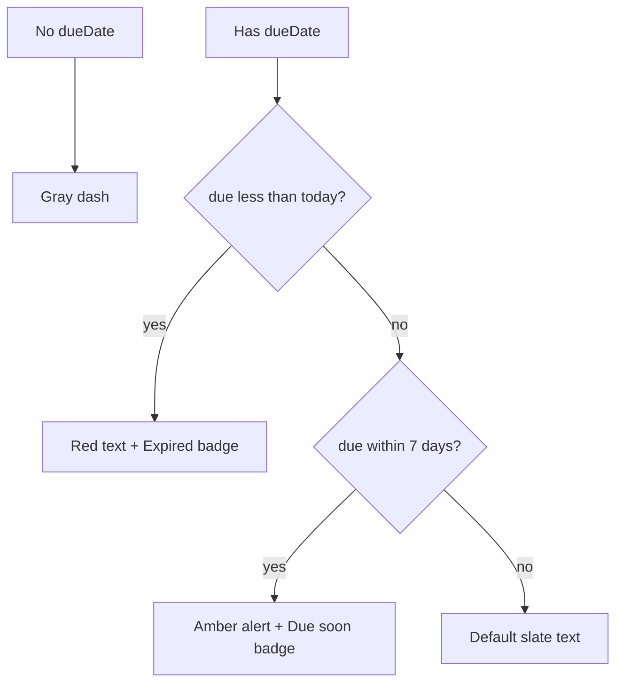

# Due Date Alert Styling in Credit Orders Table

## Goal

Highlight due dates in the credit orders table when they are **within 7 days** (today through today + 7), using warning colors distinct from the existing **Expired** (past due) state. No API changes—purely client-side, aligned with [`fetchCreditOrders` `dueDays=7`](services/Order/fetchCreditOrders.ts).

## Current behavior

In [`pages/CreditOrders.tsx`](pages/CreditOrders.tsx) (due date column ~639–650):

- Shows formatted date via `formatDueDate`
- **Expired only:** red badge when `isDueDateExpired()` ([`orderUtils.ts`](components/Orders/orderUtils.ts) — `due < today`)
- No styling for upcoming due dates within 7 days



## Implementation

### 1. Due-date helpers in [`components/Orders/orderUtils.ts`](components/Orders/orderUtils.ts)

Add (reuse `parseDueDateString` for consistent local midnight comparison):

- **`isDueDateWithinDays(dueDate: string, days: number)`** — `true` when `today <= due <= today + days` (calendar days, local timezone, same approach as `isDueDateExpired`)
- **`getDueDateUrgency(dueDate: string, withinDays = 7): 'expired' | 'near' | 'normal'`**
  - `'expired'` if `isDueDateExpired`
  - else `'near'` if `isDueDateWithinDays(dueDate, withinDays)`
  - else `'normal'`

Optional small helper **`getDueDateCellClasses(urgency)`** returning Tailwind classes for the date text/container (keeps JSX in CreditOrders readable).

### 2. Credit Orders table — [`pages/CreditOrders.tsx`](pages/CreditOrders.tsx)

In the due date `<td>`:

| Urgency   | Visual treatment                                                                                                                                                        |
| --------- | ----------------------------------------------------------------------------------------------------------------------------------------------------------------------- |
| `expired` | Keep current: red **Expired** badge; date text `text-red-700`                                                                                                           |
| `near`    | Amber pill/wrapper: `bg-amber-50 border border-amber-200 rounded-lg px-2 py-1`, date `text-amber-800 font-semibold`, badge **Due soon** (`text-amber-700 bg-amber-100`) |
| `normal`  | Unchanged slate styling                                                                                                                                                 |
| no date   | Unchanged "—"                                                                                                                                                           |

Compute once per row:

```ts
const dueDatePart = order.dueDate?.split("T")[0];
const urgency = dueDatePart ? getDueDateUrgency(dueDatePart, 7) : null;
```

Import `getDueDateUrgency` (and classes helper if added).

**Out of scope for v1:** full-row background highlight (user asked for due date column alert; column-level is sufficient unless you want row tint later).

### 3. Order detail modal (consistency) — [`components/Orders/OrderDetailModal.tsx`](components/Orders/OrderDetailModal.tsx)

Today the due-date block uses amber for **all** non-expired dates (lines 208–214). Refine to:

- `expired` → red (unchanged)
- `near` → amber (current non-expired look)
- `normal` → neutral `bg-slate-50 border-slate-200` (no false alarm for dates far out)

Show **Due soon** badge only when `near`.

### 4. i18n — [`translations/en.ts`](translations/en.ts), [`translations/my.ts`](translations/my.ts)

Under `creditOrders`:

- `dueDateDueSoon`: e.g. "Due soon" / Myanmar equivalent

(Reuse existing `dueDateExpired`; `nearDueDate` filter label already exists.)

## Files touched

| File                   | Change                                                            |
| ---------------------- | ----------------------------------------------------------------- |
| `orderUtils.ts`        | `isDueDateWithinDays`, `getDueDateUrgency`, optional class helper |
| `CreditOrders.tsx`     | Conditional styling + Due soon badge in due date column           |
| `OrderDetailModal.tsx` | Three-way urgency styling                                         |
| `en.ts`, `my.ts`       | `dueDateDueSoon` key                                              |

## Test plan

1. Order with due date **yesterday** → red + Expired (unchanged).
2. Order due **today** or **in 5 days** → amber cell + Due soon.
3. Order due **in 10 days** → normal slate, no badge.
4. Order with **no** due date → "—", no alert.
5. Open order detail for near-due order → amber block + Due soon; far-future → neutral block.
